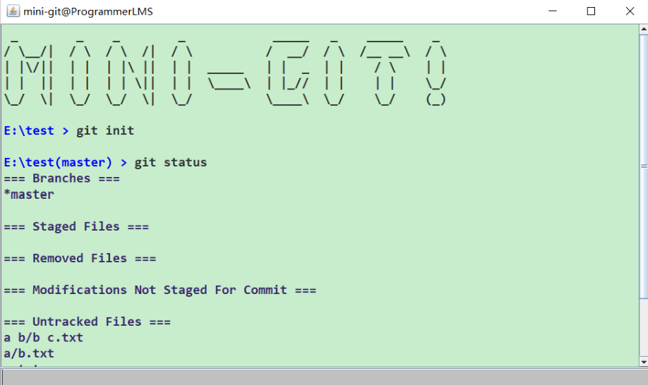

目录

- [mini-git：用Java实现一个简易版Git](#mini-git用java实现一个简易版git)
  - [0. 介绍与说明](#0-介绍与说明)
  - [1. 内部数据结构](#1-内部数据结构)
    - [1.1 blob](#11-blob)
    - [1.2 tree](#12-tree)
    - [1.3 commit](#13-commit)
    - [1.4 stage](#14-stage)
  - [2. 支持的指令](#2-支持的指令)
    - [2.1 init](#21-init)
    - [2.2 add](#22-add)
    - [2.3 commit](#23-commit)
    - [2.4 status](#24-status)
    - [2.5 log](#25-log)
    - [2.6 rm](#26-rm)
    - [2.7 branch](#27-branch)
    - [2.8 checkout](#28-checkout)
  - [3. 额外功能](#3-额外功能)
  - [4. 文件目录](#4-文件目录)
  - [5. 运行截图](#5-运行截图)
# mini-git：用Java实现一个简易版Git

特此鸣谢`UCB`提供的`skeleton code`！


## 0. 介绍与说明

本玩具项目基于作者对`Git`的理解与`Git`操作，基本实现了`Git`部分指令的底层运行原理。在技术上只使用到了`Java 8 `官方库，包括序列化、文件、集合等，适合对`Git`或`Java`基础不够熟悉的计算机新手进行源码阅读或调试。

本系统已实现的指令在下方，由于代码量小及水平有限，部分命令和`Git`软件的真实使用效果并不相同，并对一些复杂指令作出简化，请阅读下方指令的**注意事项**，避免运行中由于人工误操作出现Bug。

同时，该系统不能完全代表`Git`内部真正的工作流程，**仅仅代表**本人理解与对`Git`实操的认识，借此抛砖引玉。

## 1. 内部数据结构

### 1.1 blob

存在于`.git/object`文件夹，`blob`表示保存的文件内容。由于 `Git `会保存多个版本的文件，因此一个文件可能对应多个 `blob`：每个 `blob `在不同的`commit`中被跟踪。

### 1.2 tree

存在于`.git/object`文件夹，`tree`表示文件目录，即将名称映射为 `blob` 和其他子`tree`（子目录）引用的目录结构。在本项目中为了简化，没有包含实际的`tree`对象，而是直接通过文件路径。具体原理可见：[Git基础 — 16、Tree对象详解 - 繁华似锦Fighting - 博客园 ](https://www.cnblogs.com/liuyuelinfighting/p/16194504.html)

### 1.3 commit

存在于`.git/object`文件夹。`commit`包含了日志信息、元数据（提交日期、作者等）、对`tree`对象的引用以及对父`commit`的引用等。同时`Git`还会维护从分支头部到提交引用的映射。

### 1.4 stage

暂存区，对应`.git`中的`index`文件，在本项目中，`stage`包含了**新增文件暂存区**和**删除文件暂存区**。在下文中，我们称之为“**暂存-新增区**”与“**暂存-删除区**”。

## 2. 支持的指令

### 2.1 init

指令

- ##### `git init`

说明

- 该指令会在当前目录下创建一个新的 `mini-git` 版本控制系统。该系统将自动从一个`commit`开始：并且该提交不包含任何文件。初始状态下只有一个默认当前分支：`master`。由于 `mini-git`创建的所有版本库的初始提交内容完全相同，因此所有版本库都会自动共享该`commit`（它们都有相同的 `UID`），所有版本库中的所有`commit`都会追溯到该次提交。

### 2.2 add

指令

- ##### `git add .`

- ##### `git add [file/folder] [file/folder] ...`

说明

- 将当前存在的文件副本添加到暂存区。因此，被添加文件也称为暂存文件。重新暂存已暂存的文件会用新内容覆盖暂存区域中的前一个条目。如果文件的当前工作版本与当前提交的版本相同，则不要将其添加到暂存区；如果文件已经在暂存区，则应将其从暂存区移除（这可能发生在文件被修改、添加，然后又改回原始版本的情况下）。如果该文件在执行`git rm`命令时已在暂存区，则不会再被暂存。
- 具体原理同上。

注意事项

- 其中，`folder`为工作目录下的相对路径，如`git add a/b.txt`，如果你的路径包含空格，请加入**双引号**，如`git add "a b"`，表示名为`a b`的文件夹。由于本系统无`vim`编辑模式，**请不要只输入一个引号**。

### 2.3 commit

指令

- ##### `git commit -m [message]`

说明

- 该操作会保存当前`commit`和暂存-新增区中跟踪文件的快照，并创建一个新的`commit`,新的`commit`的父`commit`为当前`commit`。在默认情况下，每个`commit`的文件快照与其父`commit`的文件快照完全相同；它将保持文件版本的原样。新`commit`只会更新已经被添加到暂存-新增区的文件，在这种情况下，新`commit`将包含在暂存区的文件版本，而不是从父`commit`中获得的版本。同时，新`commit`将保存并开始跟踪任何父`commit`没有跟踪的文件。最后，在当前`commit`中被跟踪的文件可能会在新`commit`中被取消跟踪，因为这些文件已被 `rm `命令删除。


### 2.4 status

指令

- ##### `git status`

说明

- 表示当前工作目录的状态，包含的内容信息如下：

  ```markdown
  === Staged Files ===
  
    
  === Removed Files ===
  
    
  === Modifications Not Staged For Commit ===
  
    
  === Untracked Files ===
  
  ```

### 2.5 log

指令

- ##### `git log`

- ##### `git log -[number]`

- ##### `git log --grep=[message]`

说明

- 按时间先后，展示所有`commit`记录
- 展示给定数量的`commit`记录
- 展示包含`message`信息的`commit`记录

### 2.6 rm

指令

- ##### `git rm [file/folder] [file/folder] ...`

- ##### `git rm -f [file/folder] [file/folder] ...`

- ##### `git rm -cached [file/folder] [file/folder] ...`

说明

- 从暂存区和工作目录，删除文件或文件夹
- 强制删除
- 只删除暂存区的文件或文件夹，保留工作目录的文件或文件夹

### 2.7 branch

指令

- ##### `git branch`

- ##### `git branch [branch name]`

- ##### `git branch -d [branch name]`

说明

- 查看当前所有本地分支

- 创建分支

- 删除分支

### 2.8 checkout

指令

- ##### `git checkout [branch name]`

- ##### `git checkout -b [branch name]`

- ##### `git checkout -- [file] [file] ...`

- ##### `git checkout [commit id] -- [file] [file] ...`

说明

- 所有文件切换到给定分支
- 创建分支，并切换到该分支
- 使用当前`head commit`的文件版本覆写该文件
- 根据指定commit的文件版本覆写该文件

## 3. 额外功能

- 支持`git [command] -h`查看指令帮助
- 支持八位`commit id`检索，如`d2ee103f`
- 系统会缓存上一次最近打开的工作目录
- 系统会缓存指令，通过键盘上的`↑`与`↓`按键，即可切换指令

## 4. 文件目录

```
├─src
    │  Main.java
    │
    ├─command
    │      AddCommand.java
    │      BranchCommand.java
    │      CheckoutCommand.java
    │      CommitCommand.java
    │      ICommand.java
    │      InitCommand.java
    │      LogCommand.java
    │      MergeCommand.java
    │      ResetCommand.java
    │      RmCommand.java
    │      StatusCommand.java
    │
    ├─engine
    │      Engine.java
    │      Repository.java
    │
    ├─object
    │      Blob.java
    │      Commit.java
    │      Stage.java
    │
    ├─utils
    │      FileTreeUtils.java
    │      PersistanceUtils.java
    │
    └─view
            CommandPromptGUI.java
            ViewResponseEntity.java
            ViewResponseEnum.java
```

## 5. 运行截图



如有疑问，欢迎`emali`至programmerlms@163.com；如有`bug`，那是正常的:)